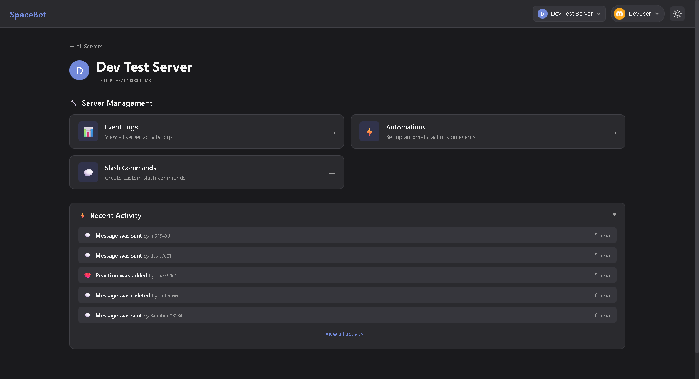
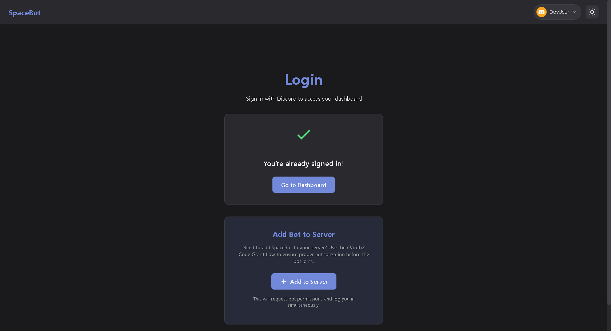
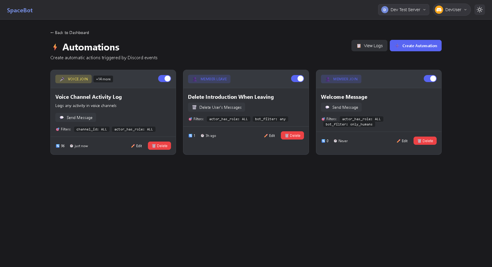
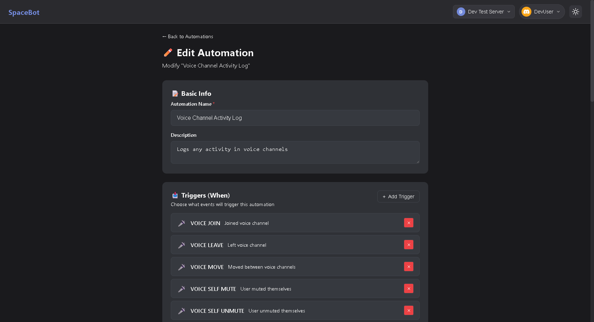
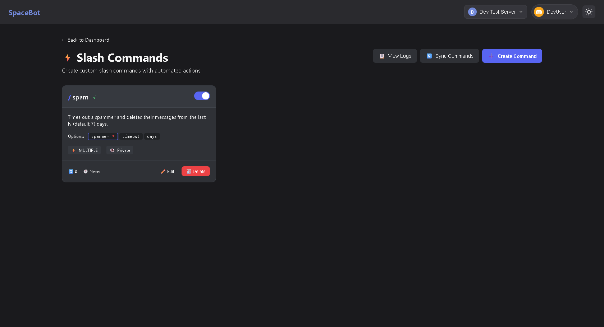
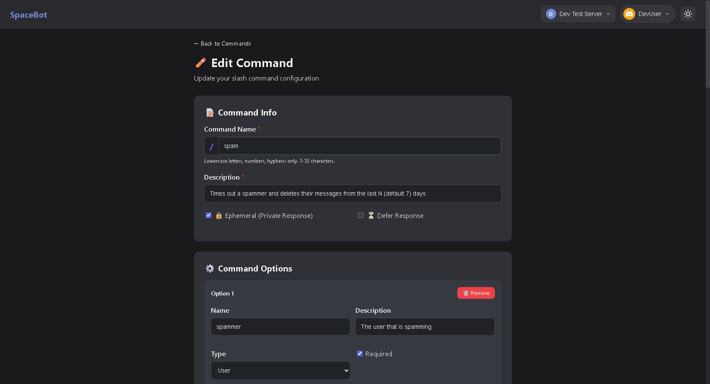
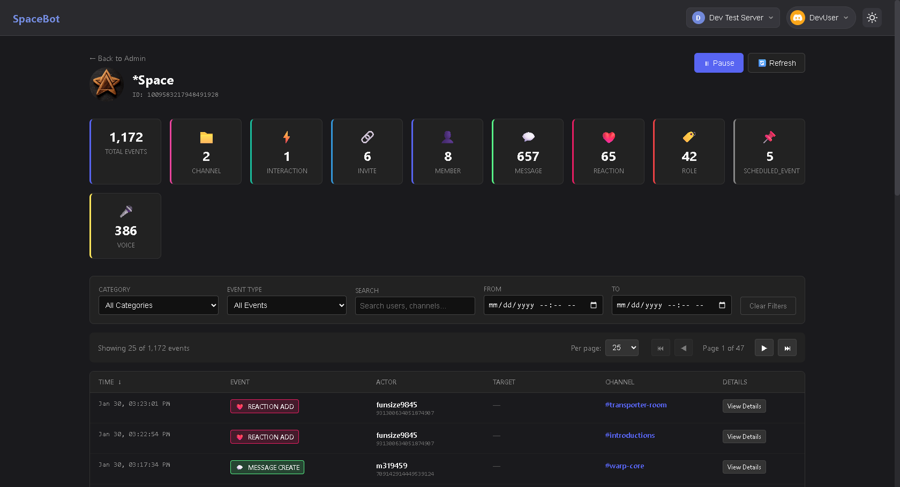

# SpaceBot 🚀

A powerful, self-hosted Discord bot platform built with **SvelteKit 2**
(Svelte 5) and deployed on **Cloudflare Pages**. Create custom slash commands,
build event-driven automations, and monitor all Discord activity through a
beautiful admin dashboard.



## ✨ Features

### 🤖 Discord Bot

- **Custom Slash Commands** — Create your own commands with parameters, choices,
  and custom responses
- **Event-Driven Automations** — Trigger actions automatically when Discord
  events occur
- **Full Gateway Support** — Real-time event capture via Discord.js gateway
  connection
- **Interactions Endpoint** — HTTP-based slash command handling via Cloudflare
  Workers

### 🌐 Web Dashboard

- **Server Selection** — Manage all servers where you're an admin
- **Event Logs** — View detailed logs of all Discord activity (members,
  messages, voice, moderation, etc.)
- **Automation Builder** — Visual interface to create event → action automations
- **Command Builder** — Design custom slash commands with the automation action
  system
- **Dark/Light Theme** — Beautiful UI with theme toggle support

### 🔐 Authentication & Security

- **Discord OAuth2** — Secure login with Discord credentials
- **Admin Access Control** — Only server admins can manage their servers
- **Request Signature Verification** — All Discord interactions are
  cryptographically verified

### ⚡ Cloudflare-Native

- **Cloudflare Pages** — Deployed on Cloudflare's global edge network
- **D1 Database** — SQLite-based serverless database for logs and configurations
- **Zero Cold Starts** — Fast response times worldwide

## 📸 Screenshots

<details>
<summary>� Discord Login</summary>



Secure Discord OAuth2 authentication for accessing the admin dashboard.

</details>

<details>
<summary>📊 Server Admin</summary>


View event logs, statistics, and quick access to automations and commands.

</details>

<details>
<summary>⚡ Automations</summary>



Create event-driven automations that trigger on Discord events like member
joins, message creates, voice state changes, and more.

</details>

<details>
<summary>🛠️ Automation Editor</summary>



Visual interface for configuring triggers, conditions, and actions for your
automations.

</details>

<details>
<summary>🎮 Custom Commands</summary>



Build custom slash commands with parameters and tie them to automation actions.

</details>

<details>
<summary>✏️ Command Editor</summary>



Design slash commands with options, parameters, and custom responses through an
intuitive editor.

</details>

<details>
<summary>📝 Event Logs</summary>



Comprehensive logging of all Discord events with filtering and search.

</details>

## 🛠️ Tech Stack

| Layer       | Technology                    |
| ----------- | ----------------------------- |
| Framework   | SvelteKit 2 (Svelte 5)        |
| Runtime     | Cloudflare Pages/Workers      |
| Database    | Cloudflare D1 (SQLite)        |
| Bot Library | Discord.js 14                 |
| Styling     | Custom CSS with CSS Variables |
| Auth        | Discord OAuth2                |

## 🚀 Getting Started

### Prerequisites

- Node.js 18+
- A Discord Application
  ([create one here](https://discord.com/developers/applications))
- A Cloudflare account ([sign up here](https://dash.cloudflare.com/sign-up))
- (Optional)
  [cloudflared](https://developers.cloudflare.com/cloudflare-one/connections/connect-networks/downloads/)
  for local tunneling

### Installation

1. **Clone the repository**
   ```bash
   git clone https://github.com/starspacegroup/spacebot.git
   cd spacebot
   ```

2. **Install dependencies**
   ```bash
   npm install
   ```

3. **Configure environment variables**

   Copy `.env.example` to `.env` and fill in your Discord credentials:
   ```bash
   cp .env.example .env
   ```

   Required variables:
   | Variable                | Description                                               |
   | ----------------------- | --------------------------------------------------------- |
   | `DISCORD_PUBLIC_KEY`    | Found in your app's "General Information"                 |
   | `DISCORD_CLIENT_ID`     | Your application's Client ID                              |
   | `DISCORD_CLIENT_SECRET` | Found under OAuth2 settings                               |
   | `DISCORD_BOT_TOKEN`     | Found under "Bot" settings                                |
   | `ADMIN_USER_IDS`        | Comma-separated Discord user IDs with global admin access |
   | `LOG_LEVEL`             | Logging verbosity: `error`, `warn`, `info`, `debug`       |

4. **Set up the database (local development)**
   ```bash
   npm run db:migrate:local
   ```

5. **Run the development server**
   ```bash
   npm run dev
   ```
   The app will be available at `http://localhost:5173`

6. **Start the Gateway bot** (in a separate terminal)
   ```bash
   npm run dev:gateway
   ```
   This captures Discord events and processes automations.

### Discord Bot Setup

1. Go to [Discord Developer Portal](https://discord.com/developers/applications)
2. Select your application → **Bot**
3. Enable **Privileged Gateway Intents**:
   - ✅ Presence Intent
   - ✅ Server Members Intent
   - ✅ Message Content Intent
4. Go to **OAuth2** → **URL Generator**
   - Scopes: `bot`, `applications.commands`
   - Permissions: Administrator (or customize as needed)
5. Use the generated URL to invite the bot to your server

### Setting up Interactions Endpoint

For production, configure Discord to send interactions to your Cloudflare Pages
URL:

1. Deploy to Cloudflare Pages (see [Deployment](#-deployment))
2. Go to Discord Developer Portal → Your Application → **General Information**
3. Set **Interactions Endpoint URL** to:
   ```
   https://your-domain.pages.dev/api/discord/interactions
   ```

## 📦 Available npm Scripts

| Script                      | Description                                      |
| --------------------------- | ------------------------------------------------ |
| `npm run dev`               | Start SvelteKit dev server                       |
| `npm run dev:wrangler`      | Run with Wrangler (Cloudflare local environment) |
| `npm run dev:gateway`       | Start Discord gateway bot                        |
| `npm run dev:tunnel`        | Start cloudflared tunnel for local development   |
| `npm run build`             | Build for production                             |
| `npm run db:migrate`        | Run database migrations (production)             |
| `npm run db:migrate:local`  | Run database migrations (local)                  |
| `npm run register-commands` | Register slash commands with Discord             |

## 🔄 Automations

SpaceBot's automation engine lets you create powerful event-driven workflows:

### Supported Triggers

- **Member Events** — Join, leave, ban, unban, kick, timeout
- **Message Events** — Create, edit, delete, bulk delete
- **Voice Events** — Join, leave, mute, deafen, stream, video
- **Role Events** — Create, delete, update, member role add/remove
- **Channel Events** — Create, delete, update
- **Reaction Events** — Add, remove
- **Interaction Events** — Slash commands, button clicks, modals
- **And many more...**

### Available Actions

- 📨 **Send Message** — Send a message to a channel
- 🗑️ **Delete Messages** — Delete messages from a user
- 🏷️ **Add/Remove Role** — Modify member roles
- 👢 **Kick Member** — Kick a member from the server
- 🔨 **Ban Member** — Ban a member
- ⏰ **Timeout Member** — Timeout a member
- 📢 **Send DM** — Send a direct message to a user

### Template Variables

Use dynamic variables in your messages:

```
Welcome {user.mention} to {guild.name}!
```

Available: `{user.id}`, `{user.name}`, `{user.mention}`, `{channel.name}`,
`{guild.name}`, `{option.<name>}`, and more.

## 🎮 Custom Commands

Create custom slash commands through the web dashboard:

1. Navigate to **Admin** → **Your Server** → **Commands**
2. Click **New Command**
3. Configure:
   - Command name and description
   - Parameters (text, numbers, users, channels, roles, etc.)
   - Response message or embed
   - Optional: Tie to an automation action
4. Click **Register with Discord** to sync

## 📋 Event Logging

SpaceBot captures and logs all Discord events:

| Category       | Events                                     |
| -------------- | ------------------------------------------ |
| 👤 Member      | Join, leave, update, nickname changes      |
| 💬 Message     | Create, edit, delete, bulk delete          |
| 🎤 Voice       | Join, leave, mute, deafen, stream, video   |
| 📁 Channel     | Create, delete, update                     |
| 🏷️ Role        | Create, delete, update, member assignments |
| 🔨 Moderation  | Ban, unban, kick, timeout                  |
| ⚡ Interaction | Commands, buttons, modals, select menus    |
| 📅 Events      | Scheduled event create, update, delete     |

## 🌐 Deployment

### Deploy to Cloudflare Pages (Recommended)

1. **Push to GitHub**
   ```bash
   git push origin main
   ```

2. **Connect to Cloudflare Pages**
   - Go to [Cloudflare Dashboard](https://dash.cloudflare.com)
   - **Workers & Pages** → **Create application** → **Pages** → **Connect to
     Git**
   - Select your repository
   - Configure:
     - **Build command**: `npm run build`
     - **Build output**: `.svelte-kit/cloudflare`

3. **Add Environment Variables** In Cloudflare Pages Settings → Environment
   Variables, add all required variables.

4. **Create D1 Database**
   ```bash
   wrangler d1 create spacebot-logs
   ```
   Update `wrangler.toml` with the database ID.

5. **Run Migrations**
   ```bash
   npm run db:migrate
   ```

6. **Deploy** Future pushes to `main` will auto-deploy.

See [DEPLOYMENT.md](DEPLOYMENT.md) for detailed instructions.

## 📁 Project Structure

```
spacebot/
├── src/
│   ├── lib/
│   │   ├── automation/       # Automation engine
│   │   ├── components/       # Svelte components
│   │   ├── db/               # Database functions
│   │   │   ├── automations.js
│   │   │   ├── commands.js
│   │   │   └── logger.js
│   │   └── discord/          # Discord integration
│   │       ├── cache.js
│   │       ├── commands.js
│   │       ├── gateway.js    # Gateway bot service
│   │       └── guilds.js
│   ├── routes/
│   │   ├── admin/            # Admin dashboard pages
│   │   │   ├── [serverId]/   # Per-server management
│   │   │   │   ├── automations/
│   │   │   │   ├── commands/
│   │   │   │   └── logs/
│   │   ├── api/              # API endpoints
│   │   │   ├── automations/
│   │   │   ├── commands/
│   │   │   ├── discord/
│   │   │   └── logs/
│   │   └── login/
│   └── app.html
├── migrations/               # D1 database migrations
├── scripts/                  # Utility scripts
├── static/                   # Static assets
└── docs/
    └── screenshots/          # Documentation images
```

## 🔒 Security

- ✅ Discord request signature verification
- ✅ HTTP-only secure cookies
- ✅ Admin permission checks
- ✅ Environment variable secrets
- ✅ HTTPS via Cloudflare

## 🗺️ Roadmap

See [ROADMAP.md](ROADMAP.md) for planned features and enhancements.

## 📄 License

MIT

## 🔗 Resources

- [SvelteKit Documentation](https://kit.svelte.dev)
- [Discord.js Guide](https://discordjs.guide)
- [Cloudflare Pages Docs](https://developers.cloudflare.com/pages)
- [Cloudflare D1 Docs](https://developers.cloudflare.com/d1)
- [Discord Developer Portal](https://discord.com/developers/docs)
