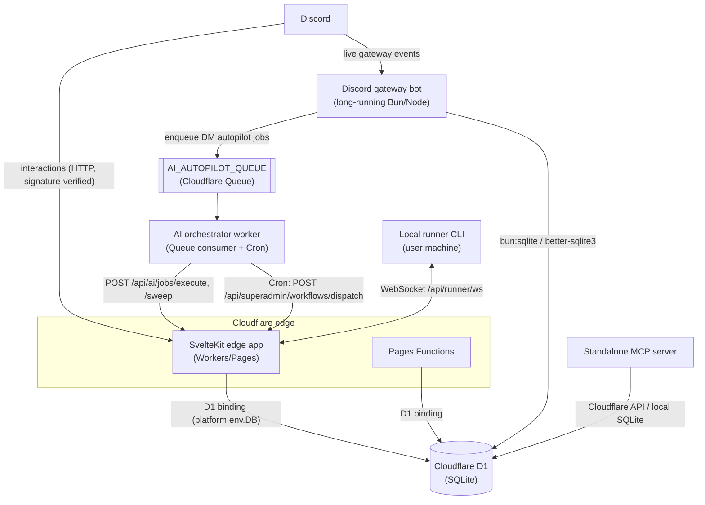
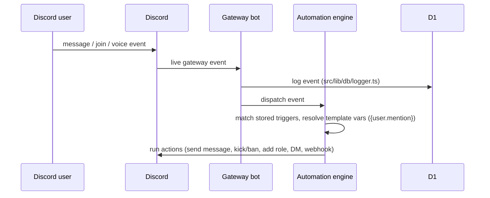

# Architecture

SpaceBot is **not** a single process. The same repository produces code for
several cooperating runtimes that share one Cloudflare D1 (SQLite) database. A
file's location determines which runtime it runs in, and therefore how it reaches
environment variables and the database.

| Runtime | Entry | Env access | DB access |
| --- | --- | --- | --- |
| **SvelteKit edge app** (Cloudflare Workers/Pages) | `src/routes/**`, `src/hooks.server.ts` | `platform.env.X` | D1 binding `platform.env.DB` |
| **Discord gateway bot** (long-running Bun/Node) | `src/lib/discord/gateway.ts` | `process.env.X` (+ `loadSecrets()`) | `bun:sqlite` / `better-sqlite3` |
| **AI orchestrator worker** (Queue consumer) | `orchestrator-worker/src/` | Worker `env` | calls back into Pages API (no direct DB) |
| **Local runner** (user machine CLI) | `scripts/local-runner/index.ts` | `process.env` | none — talks to server over WebSocket |
| **Pages Functions** | `_functions/` | Pages `env` | D1 |
| **Standalone MCP server** | `mcp-server/index.js` | `process.env` | Cloudflare API / local SQLite |

Because code in `src/lib/` is imported by *both* the edge app and the Node
gateway, env access goes through the `getEnv(name, platform)` helper
(`platform.env` first, then `process.env`).

## Runtimes and data flow

Notes on the arrows:

- The **edge app**, **Pages Functions**, and **gateway bot** are the only
  components that touch the database directly — and the gateway uses a local
  SQLite driver rather than the D1 binding.
- The **orchestrator worker** has no direct DB access; it calls back into the
  Pages API. It also owns the scheduler tick via a Cron Trigger.
- The **local runner** has no DB access at all; it only speaks WebSocket to the
  server.

## Request → event → automation flow

1. **Discord interactions** (slash commands, buttons) hit
   `POST /api/discord/interactions` on the edge app and are signature-verified.
2. **Live Discord events** are captured by the gateway bot, logged to D1, and fed
   into the automation engine (`src/lib/automation/engine.ts`).
3. The **automation engine** matches stored triggers to events and runs actions,
   resolving template variables like `{user.mention}`.
4. **AI DM autopilot**: when `DM_AUTOPILOT_ENABLED=true`, gateway DMs are enqueued
   onto the `AI_AUTOPILOT_QUEUE` Cloudflare Queue; the orchestrator worker
   consumes them and calls back into the Pages API
   (secured by `AI_AUTOPILOT_INTERNAL_KEY`). See
   [ai-autopilot.md](ai-autopilot.md).

For the authoritative, always-current architecture notes, see
[`CLAUDE.md`](../CLAUDE.md).
